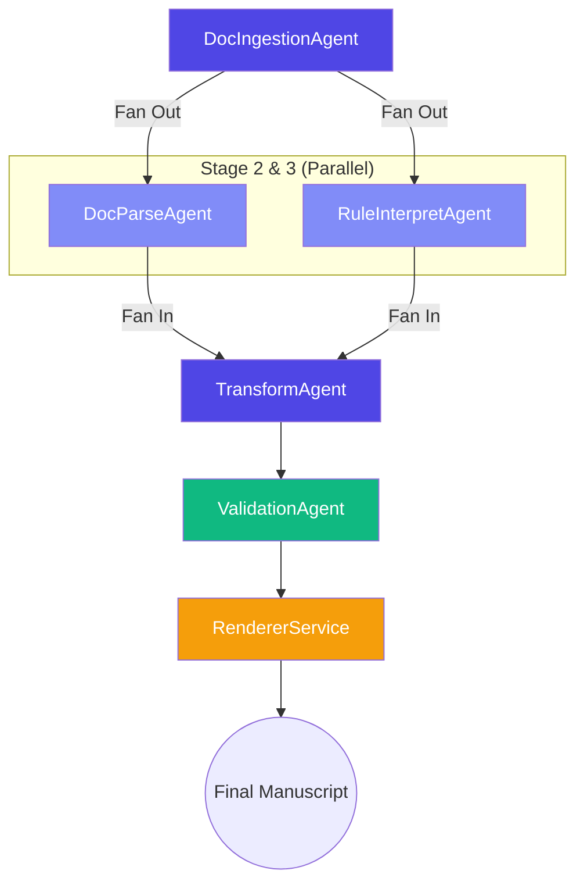

# 🤖 Agent Paperpal

> **Advanced Agentic AI for Academic Manuscript Formatting**  
> *Automatically reformat research papers to comply with 10,000+ journal style guidelines using LLM-powered multi-agent orchestration.*

---

## 🌟 Overview

**Agent Paperpal** is an AI-driven system designed to solve the "Journal Guidelines Headache" for researchers. By leveraging a **multi-agent orchestration framework (LangGraph)**, it autonomously interprets complex journal guidelines from the web, parses the structural components of a manuscript, and applies precise stylistic transformations—all in a matter of seconds.

### Core Value Proposition
- **High-Fidelity Parsing**: Beyond simple text extraction; understands the semantics of headings, citations, and references.
- **Dynamic Rule Interpretation**: Scrapes real-time journal guidelines and uses **Gemini 2.0 Flash** to convert prose instructions into structured, machine-readable formatting rules.
- **Precise Transformation**: Automatically applies changes to citation styles, heading hierarchies, abstract layouts, and more.
- **Compliance Certification**: Provides a final "Compliance Score" and detailed audit trail of every change made.

---

## 🏗️ System Architecture

Agent Paperpal uses a state-of-the-art **Directed Acyclic Graph (DAG)** orchestration model via `LangGraph`. This allows for both sequential logic and parallel efficiency.



### The 5-Stage Agentic Pipeline

| Stage | Name | Description | Tech Highlight |
|:---:|:---|:---|:---|
| **1** | **Ingesting** | Extracts raw text and metadata from `.docx`, `.pdf`, or `.txt`. | `python-docx`, `PyMuPDF` |
| **2** | **Parsing** | Identifies semantic sections (Abstract, Titles, Refs) and detects current style. | `spaCy NER`, Regex Cascade |
| **3** | **Interpreting** | Scrapes journal web pages and extracts structured rules (JRO). | `Playwright`, `Gemini 2.0` |
| **4** | **Transforming** | Applies JRO rules to the annotated manuscript structure. | Dynamic IR Transformation |
| **5** | **Validating** | Compares final output against instructions and generates a score. | LLM-based Compliance Check |
| **Final** | **Rendering** | Rebuilds the document into a polished, downloadable Word/PDF file. | `RendererService` |

---

## 🛠️ Tech Stack

| Component | Technology |
|:---|:---|
| **Pipeline Orchestrator** | `LangGraph` (Stateful Multi-Agent Framework) |
| **Backend Framework** | `FastAPI` (Python 3.12+), `Celery` (Distributed Tasks) |
| **Language Model** | `Google Gemini 2.0 Flash` (Optimized for speed/cost) |
| **Frontend** | `React 18`, `Vite`, `Tailwind CSS`, `Redux Toolkit` |
| **Real-time Status** | `WebSockets` (Pub/Sub via Redis) |
| **Database/Cache** | `PostgreSQL 16` (SQLAlchemy 2.0), `Redis 7` |
| **Storage** | `MinIO` (Local Development), `AWS S3` (Production) |

---

## 🚀 Getting Started

### Prerequisites
- **Python 3.12+** & **Node.js 20+**
- **Docker Desktop** (Essential for Local DB/Redis/MinIO)
- **Google Gemini API Key** (Generate at [Google AI Studio](https://aistudio.google.com/))

### 1. Installation

```bash
# Clone the repository
git clone https://github.com/krunalsakpal679-hue/Paperpal-Agent.git
cd agent-paperpal

# Setup Environment
cp .env.example .env
# Edit .env and paste your GOOGLE_API_KEY
```

### 2. Infrastructure Setup
Use the provided Makefile to spin up the local services (PostgreSQL, Redis, MinIO):
```bash
make infra-up
```

### 3. Dependency Installation & Database Setup
```bash
make install
make migrate
```

### 4. Running the Application
Open three terminal windows (or tabs) and run:
```bash
# Tab 1: FastAPI Server
make dev-backend

# Tab 2: Celery Pipeline Worker
make dev-celery

# Tab 3: React Frontend
make dev-frontend
```

**Access URLs:**
- **UI**: [http://localhost:5173](http://localhost:5173)
- **API Docs**: [http://localhost:8000/docs](http://localhost:8000/docs)
- **MinIO Console**: [http://localhost:9001](http://localhost:9001)

---

## 📁 Project Structure

```text
├── backend/
│   ├── app/
│   │   ├── agents/          # Agent Node Implementations (Ingest, Parse, etc.)
│   │   ├── api/             # RESTful Routes & WebSocket Handlers
│   │   ├── models/          # SQLAlchemy Database Models
│   │   ├── schemas/         # Pydantic v2 Models & Orchestrator State
│   │   ├── services/        # Storage, Cache, and Rendering Logic
│   │   └── worker/          # Celery Task Definitions
├── frontend/
│   ├── src/
│   │   ├── components/      # UI: Pipeline visualizer, Upload, Results
│   │   ├── hooks/           # WebSocket status streaming logic
│   │   └── store/           # Redux global state management
└── scripts/                 # Testing & Initialization utilities
```

---

## 🧪 Development Commands

```bash
make install          # Install all dependencies
make dev-backend      # Start backend dev server
make dev-celery       # Start celery worker
make dev-frontend     # Start frontend dev server
make test             # Run all tests
make lint             # Check for errors (Ruff + ESLint)
make format           # Auto-format all Python code
```

---

## 📄 License
Copyright © 2026 **Agent Paperpal** — *Empowering researchers via agentic automation.*
Built for **HackaMined 2026** (Cactus Communications).
